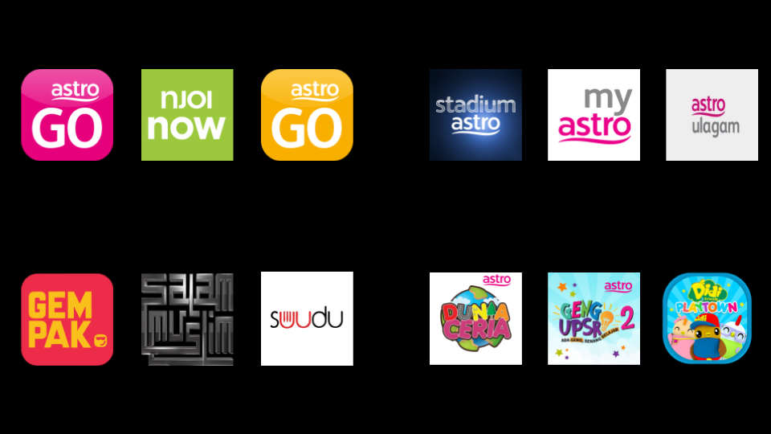
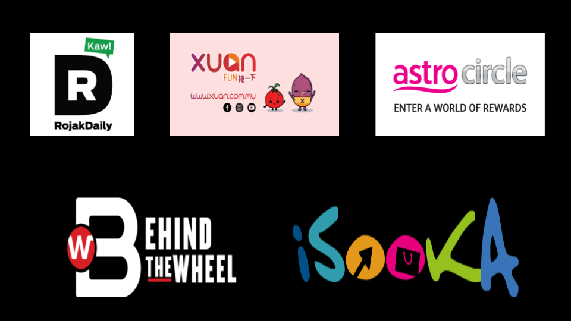
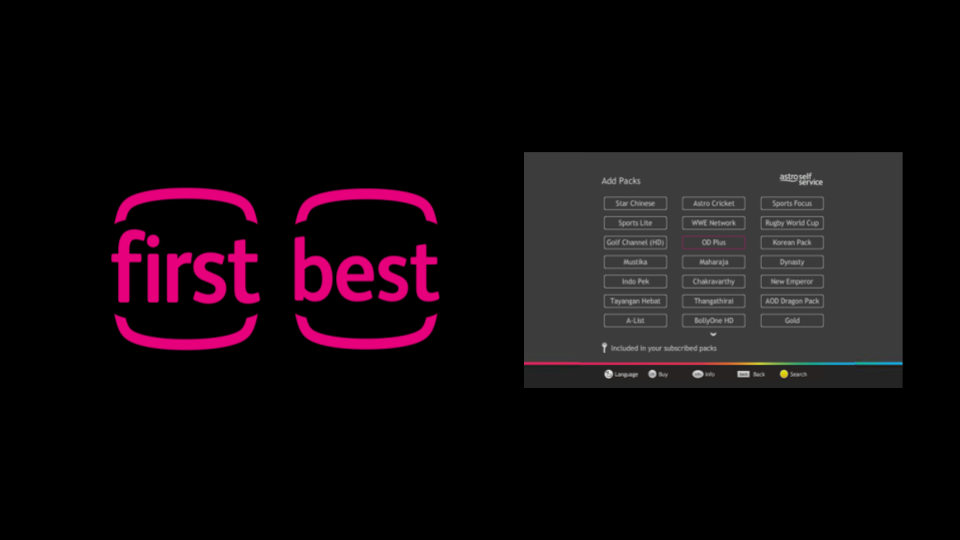
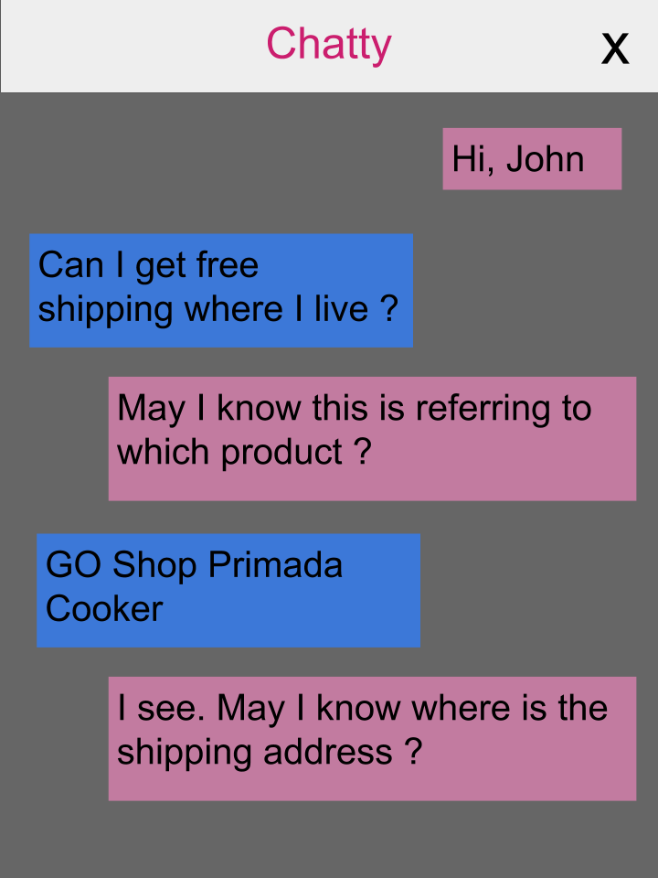
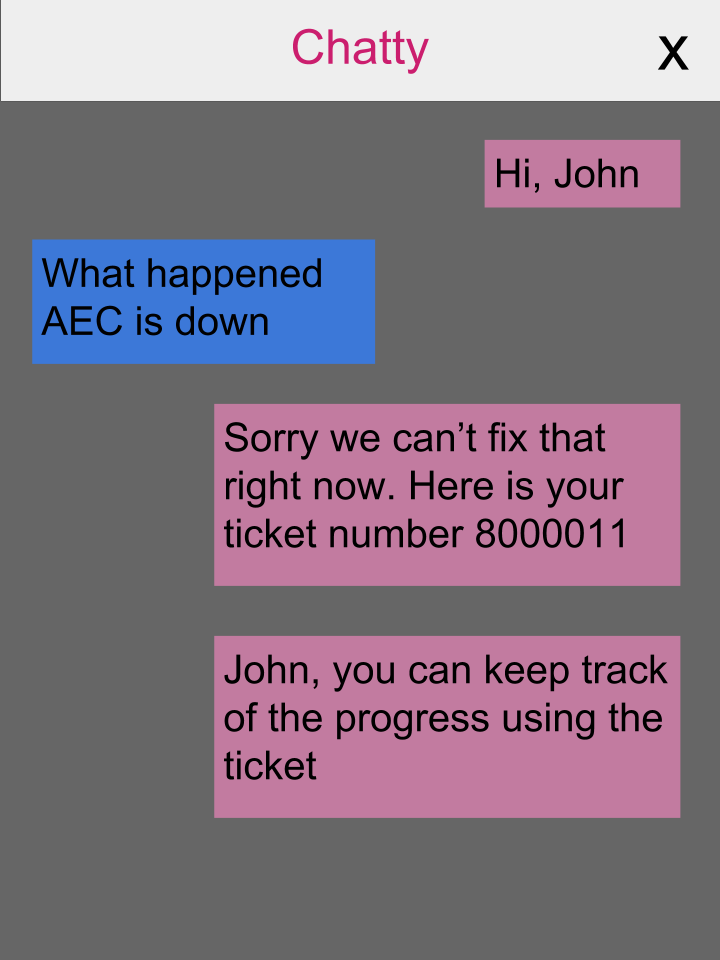
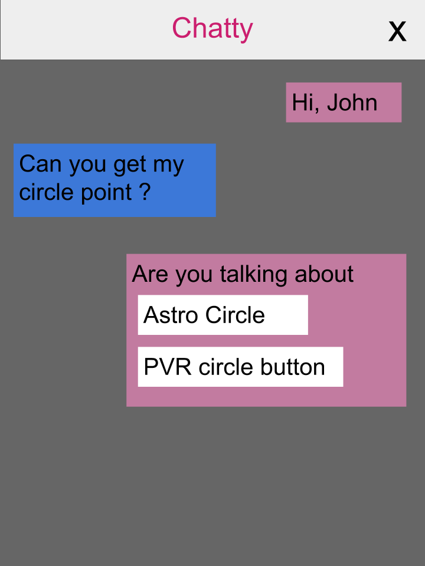
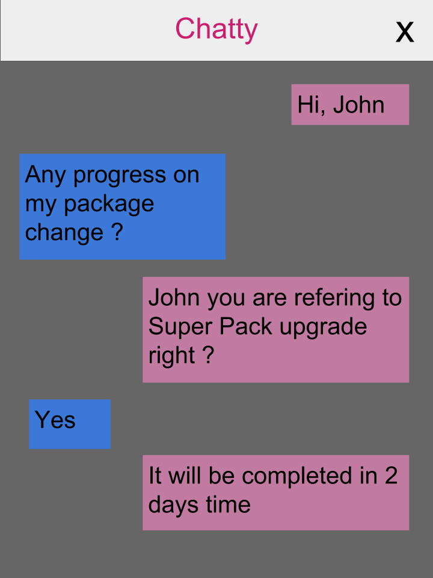
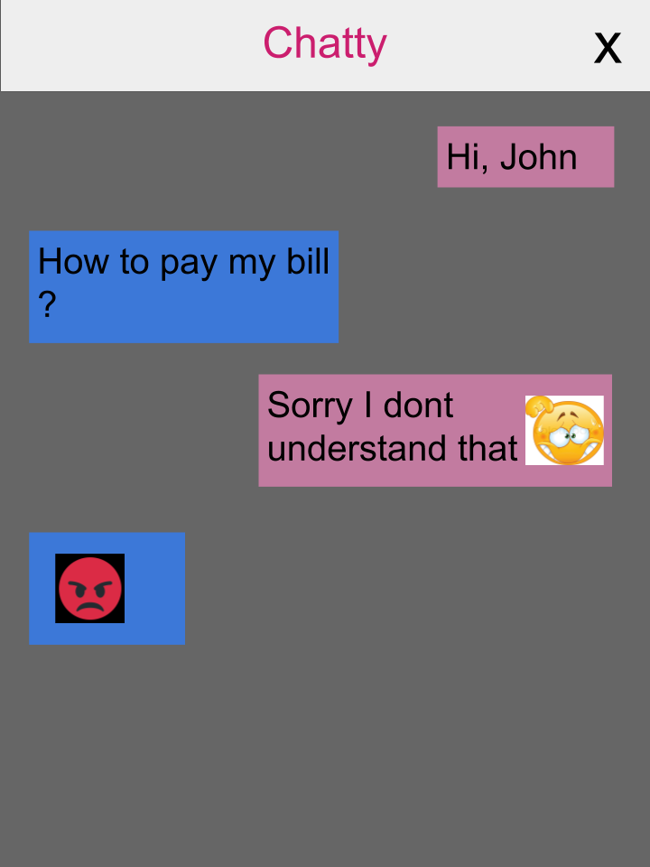
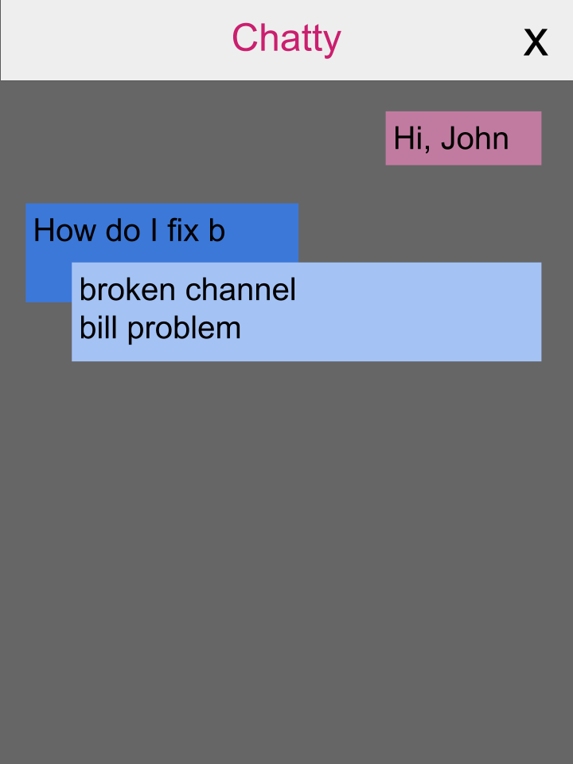

---
title:
- TAP Digital Product Management
subtitle:
- Learning & Feedback
author:
- Tan Soon Jin
logo: astro.png
theme:
- CambridgeUS
colortheme:
- beaver
---

# EXPECTATIONS: Before joining D5

+ Product manager has sole ownership and final say on direction of the product
+ Technical challenge is the biggest obstacle
+ The job is done after the product is delivered to end users

# REALITY: After joining D5

+ Aligning everyone's expectations to move forward
+ Constant iteration to improve the product
+ Creating the *RIGHT* product for the *RIGHT* users

# Getting to know D5 

# #1: Day in the Life of a Product Manager

## Project

+ Conceptualizing user journey based on requirements
+ Kickstarting the product
+ Roadmap planning along with business

## BAU

+ Handling request to add/update/change the product
+ Handling ad-hoc reporting request from business
+ Participation in scrum activities i.e. daily standup, sprint planning ...

# #2: Our partners in crime

## Infrastructure

+ AWS instance provisioning and permission handling
+ Level 2 support for issues related to infrastructure
+ Creating necessay toolsets or pipelines needed by development team

## Development 

+ Separated into mobile apps and web team
+ Implementing mockups designed by UI/UX team
+ Setup templates that can be reused by business at the start of a product lifecycle

# #2: Our partners in crime (cont'd)

## UI/UX

+ Design wireframe and mockups given requirements from business
+ Advise on UI/UX changes for digital product

## Analytics

+ GTM (Google Tag Manager): event tracking, custom tracking
+ Report & Analysis: benchmark(ComScore, AppAnnie), competitive analysis(SimilarWeb), monthly reporting (DataStudio)
+ Deep dive when requested to analyze for a particular event i.e. World Cup or campaign

# #3: Our digital products: Mobile Apps

# #3: Our digital products: Websites

# #3: Our digital products: Misc & TV Portals

# Chatbot: ACM

# Managing BAU tasks

+ **Scrum management: ** scrum call, scrum planning
+ **UI/UX changes: ** survey, icon ...
+ **Reporting: ** users, sessions, live agent requests

# Beyond BAU tasks

+ Roadmap planning
+ Assist implementation of decision tree flow
+ UAT

# Design Thinking: Identify and observe

## Going out in the field

+ 10 participants (low end and extreme users)
+ Identify unmet user needs and frustrations
+ Asking 5 Whys and observing body language

## User needs

+ Troubleshooting product related issues
+ One stop portal to access services offered by the business
+ Product/service discovery

# Design Thinking: Iterating the solution

## Problem Statement

As a user, I need to enquire about a product/service but it often takes too
much effort and time to resolve my enquiry. No care or attention is paid to me
as a user when seeking for help

## Approach to the problem

+ Focus on error handling
+ Making mistakes more forgiving
+ Personalization

# What works ?: Multiple prompts

# What works ?: Follow-up ticket

# What works ?: "Do you mean ..."

# What works ?: Keeping track of previous interactions

# What doesn't works ? Emoji

# What doesn't work ? Auto complete

# Chatbot Analytics: Actionable insights

## What do we *MEASURE*

+ Unrecognized user message
+ Survey comments with rating = 1
+ User transcripts

## What are the *FINDINGS* ?

+ Unable to recognize user queries
+ Failure handling is not well implemented
+ Users expect chatbot to be omnipotent

# How do we know what users mean ?

## Topic Modeling

+ Grouping unrecognized according to keywords
+ Human expert will curate through these topics and assign suitable intent
+ Create a positive feedback loop on the chatbot engine

## Input preprocessing

+ Abbreviation/slang handling
+ Removing repeated character
+ Spelling correction
+ Language detection & translation

# Recommendations for TAP

+ Help to update product documentation
+ To work on 2 digital products
+ Run design thinking concurrently from the start

# Feedback to D5 (Chatbot)

+ More comprehensive documentation about the product along with decision log
+ Keep the scrum call to a minimal (15 mins)
+ Focus on monitoring and logging after deployment in production
+ Improve CI/CD pipeline: Canary release & Blue green deployment
